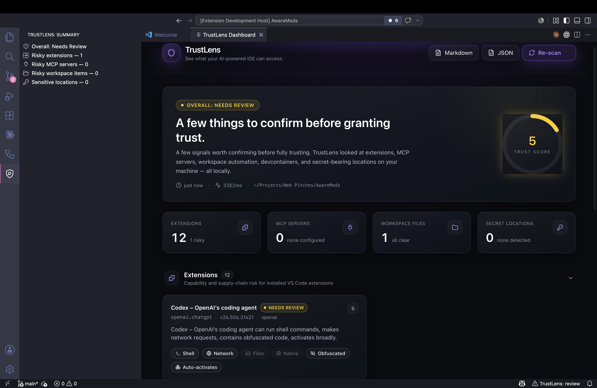

# TrustLens

TrustLens by NetXil is a local-first VS Code extension that maps risk across an AI-powered development environment. It scans installed extensions, MCP servers, workspace automation, dev containers, package scripts, and sensitive local locations so developers can see what can run commands, read files, reach the network, or touch secrets before they grant trust.



## Why TrustLens

Modern IDEs are no longer simple editors. Extensions, coding agents, MCP servers, dev containers, workspace tasks, and package scripts can all access powerful local capabilities. TrustLens gives developers a single dashboard for understanding that local attack surface without uploading source code or secrets.

TrustLens is designed for developers who want fast, practical answers:

- Which installed extensions can spawn shell commands?
- Which tools appear able to make outbound network requests?
- Which workspace files can trigger automation?
- Which MCP servers are configured locally?
- Which sensitive locations are reachable by the IDE process?

## Highlights

- Scans VS Code extensions for shell, network, filesystem, native binary, broad activation, and suspicious code signals.
- Uses Marketplace publisher verification dynamically instead of a hardcoded extension allowlist.
- Omits TrustLens itself and configurable ignored publishers such as `netxil`.
- Reviews MCP configuration across common clients.
- Checks workspace tasks, launch configs, settings, dev containers, and npm scripts.
- Reports sensitive local locations without opening secret contents.
- Exports scan results as Markdown or JSON.

## Privacy

TrustLens runs locally inside VS Code. It does not upload source code, workspace files, or secret contents. Secret checks only report whether sensitive locations exist and are reachable.

## Development

Install dependencies:

```sh
npm run install:all
```

Run type checks:

```sh
npm run type-check
```

Build the extension and webview:

```sh
npm run build
```

Launch the extension from VS Code with the included Extension Development Host configuration, then run `TrustLens: Open Dashboard`.

## Continuous Integration

GitHub Actions runs `npm ci`, webview dependency installation, `npm run type-check`, and `npm run build` on every push and pull request.

## Settings

- `trustlens.scanOnStartup`: open and scan automatically when VS Code starts.
- `trustlens.includeBuiltinExtensions`: include built-in Microsoft extensions in extension results.
- `trustlens.ignoredExtensionPublishers`: publisher IDs to omit from extension scan results. Defaults to `["netxil"]`.
- `trustlens.verifyPublishersOnline`: query the Visual Studio Marketplace when local metadata lacks publisher verification.
